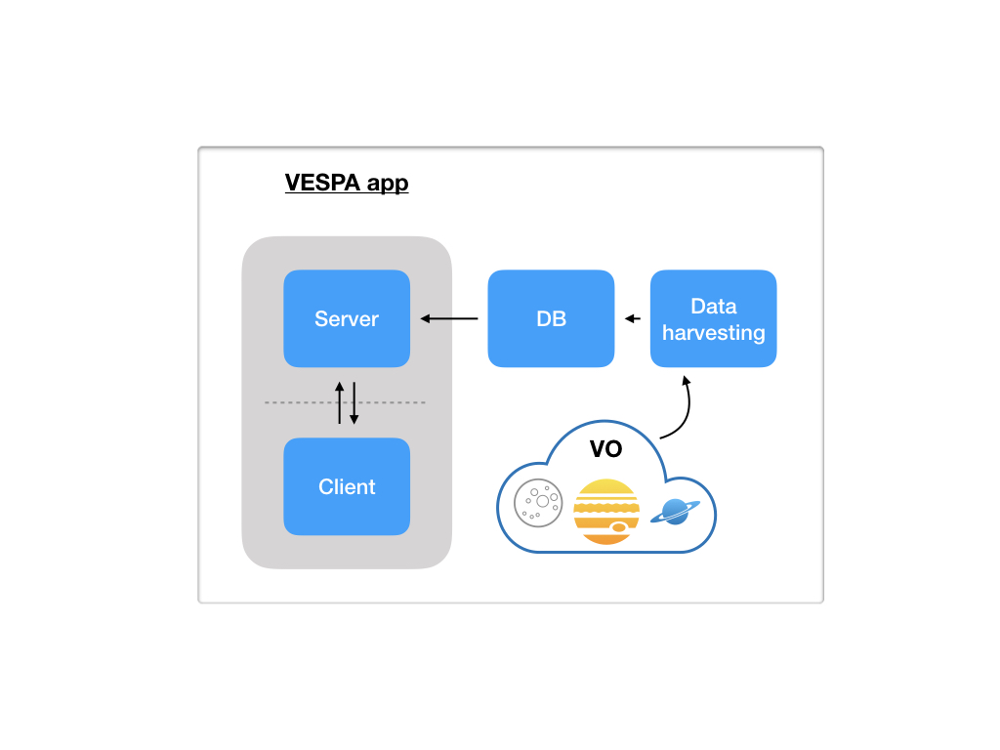
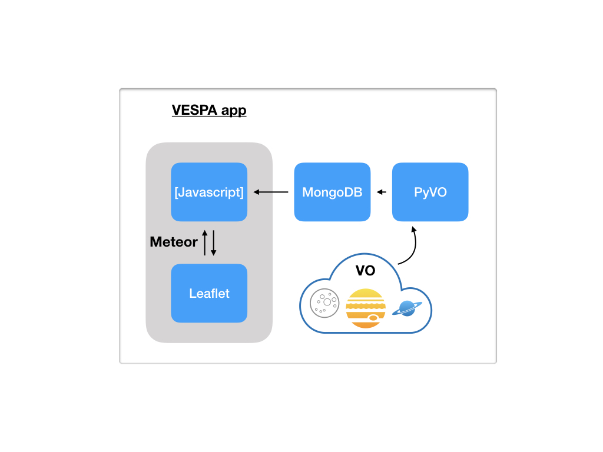

# The App

The App basic structure is shown in the following figure, it presents the software agents and there relation in data flow.

## Overview

The App is meant to present VO data through an interactive interface providing
a _map_ viewer and the respective data items geolocated over the field of view
on the _map_.
Data items are _granules_ of VO-EPN services previously retrieved and persisted
in a server-side database.
The database is MongoDB, where each document in the db has a sub-set of the data
provided by the respective VO table, enough to (i) uniquely identify/query in
the original table, (ii) geolocate the data item, (iii) provide a description or
visualization for the user first-inspection.

To orchestrate the software components, [Meteor](https://www.meteor.com/) is
applied.
To better structure the components and make them reactive to data changes,
[React.js](https://reactjs.org/).
Data persistence is managed by [MongoDB](https://www.mongodb.com/).
The interactive map is provided by [Leaflet](https://leafletjs.com/).
And the App is responsive with the help of [Bootstrap](https://getbootstrap.com/).

The figure below scratch the technical details: language, frameworks or libraries
used.

