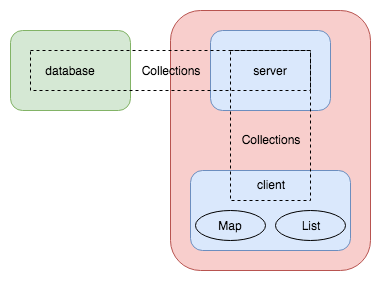

# App Components

The App is composed by the following components:
* Data collections
* UI
  * App
  * Map
  * List

Splitted between server and client to retrieve the data from the database and render it to the user, respectively, as presented in the figure below.



## Data collections

Collections is the way Meteor communicates data between the Client and the Server, and Server with the Database.
In VESPA-App the data base is managed by MongoDB, which lies in a third service, independent of Meteor.
Collections in MongoDB are part of a `database` to which we have the freedom to name and is transparent to the App: when we start the (Meteor) Server, the MongoDB `database` is directly given to it through the `MONGO_URL` environment variable.

By default, MongoDB runs at port `27017`, and if our we named our database `meteor` we would start the Meteor server as:
```bash
$ MONGO_URL='mongodb://<mongodb-host-ip-address>:27017/meteor' meteor run
```
, where `<mongodb-host-ip-address>` is the hostname or IP address of MongoDB's host.

The way the Client has access to the different collections is by _subscribing_ to each of them (from the Client side) and by _publisching_ each of them from the Server side.
This is done at the files in `vespaapp/imports/api/data*` (Server and Client), `vespaapp/server/main.js` (Server only) and `vespaapp/ui/App.js` (Client only).

To feed the different pages of the App, it is reasonable to ask the Server to do the hard work whenever possible; this increases the communication between Client and Server but dimishes the amount of data transmitted to the necessary only.
Also, depending on the query performed -- like aggregations or spatial queries -- only the Server can perform, since the Client runs a minimal version of MongoDB API (`minimongo`).


### Geo-aware collections

Data sets containing geolocated _granules_ -- entries providing non-null `s_region` or `c{1,2,3}{min,max}` fields -- are stored in a dedicated collection inside MongoDB (currently named `crism`).

MongoDB provides support for spatial queries: to query for points _within_ a certain distance, or _intersecting_ polygons, for example, over the surface of a planet.
To make use of such feature, documents in the data base have to be indexed accordingly using MongoDB's '`2dsphere`' index.
All documents of such data base (_i.e._, collection) must provide such "geolocation" information.

In such collection of our App database, it was chosen to normalize such information (`s_region` and `c{1,2}{min,max}` polygons) under a field named `geometry`.
In other words, data sets containing geolocated information must be preprocessed before their ingestion into MongoDB.
This preprocessing is straightforward though: for each _granule_, move (or copy) the required information from either the `s_region` or `c{1,2}{min,max}` fields and put under `geometry`.

The field `geometry` is composed by two sub-fields `coordinates` and `type` which specify the array of coordinates and type of geometry being represented (point, line, polygon).
Details of the structure of these fields are documented in `data/`.


## App

The `vespaapp/imports/ui/App.js` component is the entry point of data and initialization of pages of the App.
In a React.js software data always go (naturally) down in the components structure.
It is in `App.js` then that data is queried and loaded from the (Meteor/DB) collections; then passed as `props` to Map/List components.


### Routes

When a client starts the App, routes to the multiple pages are initialized.
Such routes are defined in `vespaapp/imports/startup/client/routes.js` and coupled to the `targets` defined in the homepage at `vespaapp/import/ui/Home.js`.
```diff
- TODO: move 'targets' definition to a MongoDB collection.
```


## Map

The `vespaapp/imports/ui/Map.js` component is responsible for displaying the _map-canvas_ using Leaflet.
Leaflet manages DOM nodes independently of React, which requires a slightly different design of the Map component when compered to a pure React class/function.
To make them work in harmony, React Component's lifecycle has to be observed; For instance, one will notice that the instantiation of Leaflet's layers (map, markers, etc) is done inside `componentDidMount()`, while `render()` was left with a `<div/>` placeholder.
An analogous situation happens with the `Slider.js` component, where `jQuery` is required to control the widget.

The Map component is connected to the (data) collection (`crism`) interface indirectly through the `Meteor.Session` global storage structure to allow for geo/spatial queries.
As the user moves the map boundaries (either by zooming or shifting the basemap), the database is queried for the features (_e.g._, footprints) _intersecting_ the site area.
Meteor Session objects are reactive components, which means that updates to any variable(s) stored in it will promptly trigger a reaction on _any_ component listening the respective variable(s).

In the Map component a `Session.set()` call will perform the update of the global variable `bbox` with the updated boundaries of the map after a user interaction.
Consequently, in the `App.js` component where there is a `Session.get(bbox)` statement, a new query (or _subscription_ to be more precise) to the `crism` collection will request for new data from the server, which will update the list of _granules_ presented to the user.


## List

In its simplest, the App will display a list of data items.
If the user, for example, ask for data from Jupiter all we can display is a list of images, for instance.

The `vespaapp/imports/ui/List.js` component, though, implements a somewhat sofisticated system for rendering items on demand, only the items that fit in the screen/viewport are rendered.
That behaviour provides an optimization regarding the user/client resources (namely memory and bandwidth), guarantess stability of the software, and ultimately improves the user experience.
Notice that the number of documents (_i.e._, _granules_) retrieved from the database may go up to the thousands, if not properly handled (as it _has_ been done) the client may simply go out of resources and crash.
